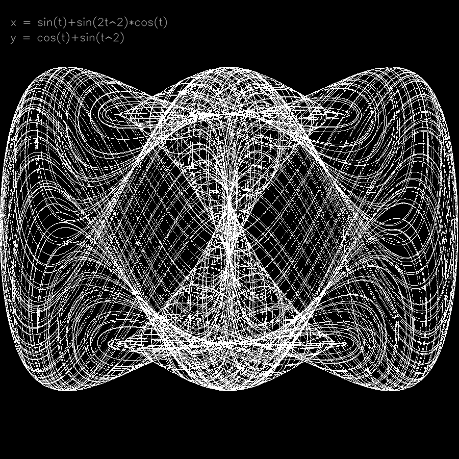
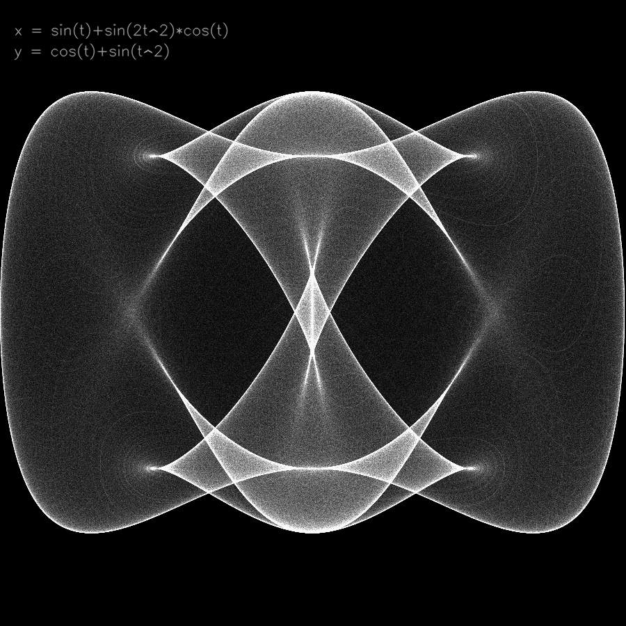
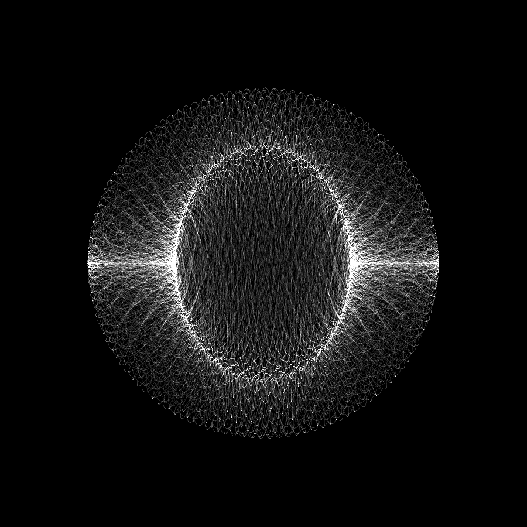

# genart_experiments
sandbox for genart expeirments

## parametric.py


Draws plot of a parametric function.
```
x = f(t)
y = g(t)
```

### Dependencies
- OpenCV
  
### Variables to set before running:
#### <b>SIZE</b>
Output image size in pixels (it's always a square)
#### <b>DURATION</b>
Max value of t
#### <b>STEP</b>
t increment
#### <b>INCREMENTAL</b>
There are two modes in which the plot is generated and it's controlled by this parameter. If <b>False</b> the output plot is set to max value (255) for each x,y pair (for each t). If <b>True</b> the output plot is incremented by small value (5) for each t. Incremental plots tens to be smoother, the difference can be seen in " section.
#### <b>SHOW_IMAGE</b>
When True, the image will be displayed in OPenCV window.
#### <b>SAVE_VIDEO</b>
WHen True, a video will be saved at the end. Be careful as I didn't find a way to compress video with OpenCV so the file might be massive, if you run long simulation.
#### <b>SAVE_HSV / H / S</b>
If set to True, a colour image will be saved with H,S fixed and generated plot used as V value.

#### <b>X_FUNC / Y_FUNC</b>
Lambda for f(t), g(t)
#### <b>X_MIN / Y_MIN</b>
Minimum value of f(t), g(t). Important to set this as it's used for normalization to go from function coordinates into image coordinates.
#### <b>X_RANGE / Y_RANGE</b>
Range of f(t), g(t) - (max-min). Important to set this as it's used for normalization to go from function coordinates into image coordinates.

### Samples

Some interesting plots can be generated using parameter settings in worth_running file.




